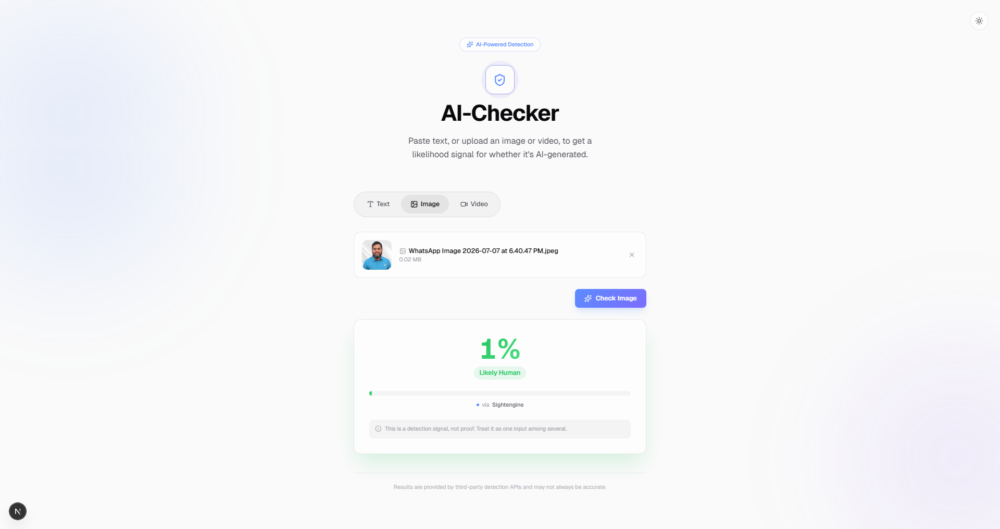
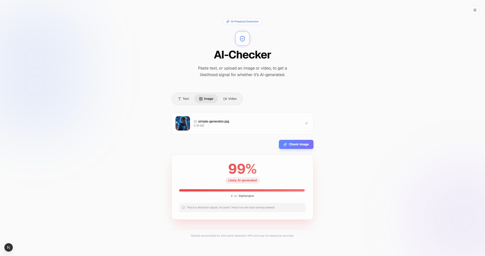
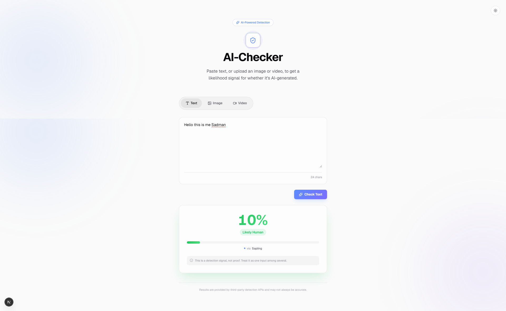
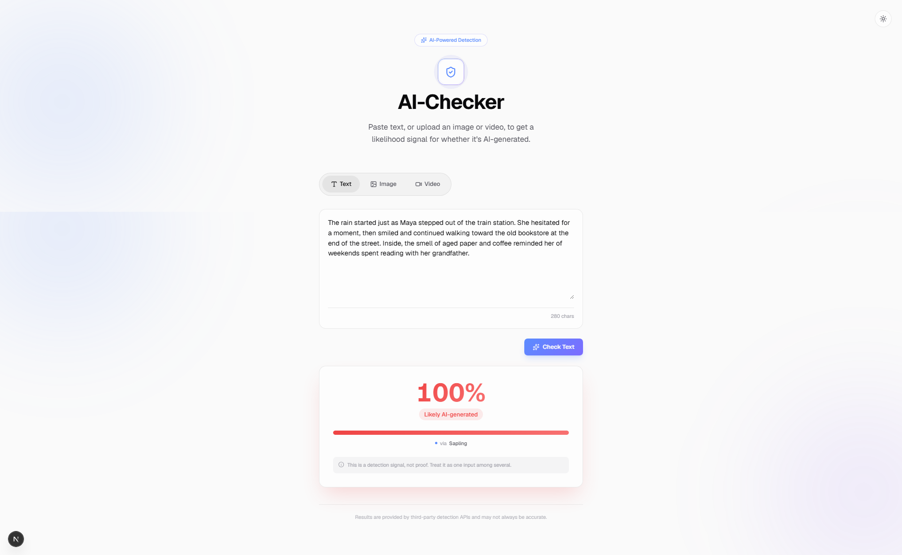
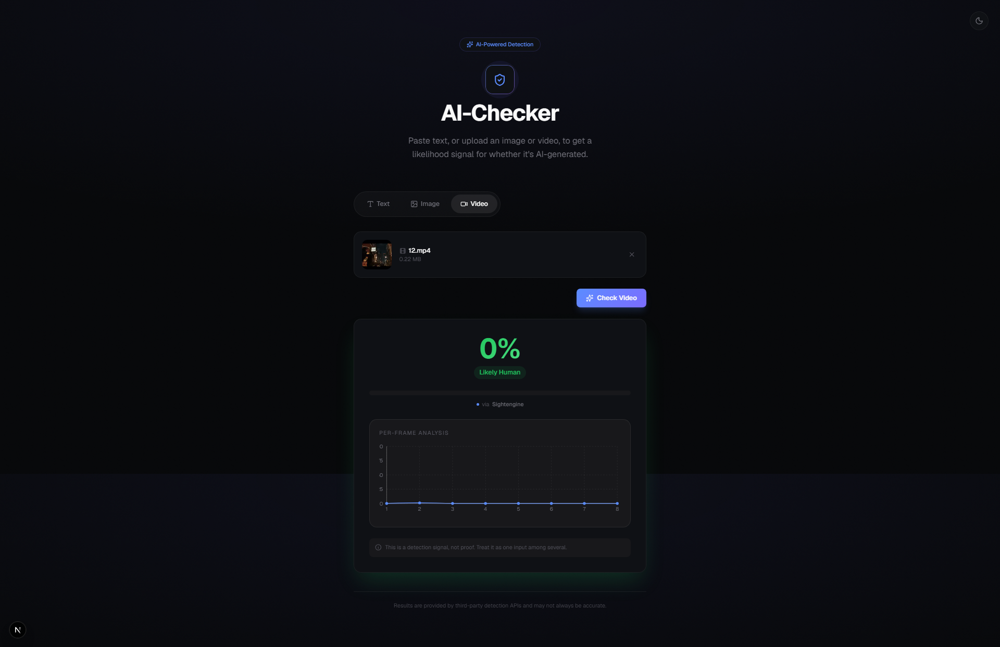
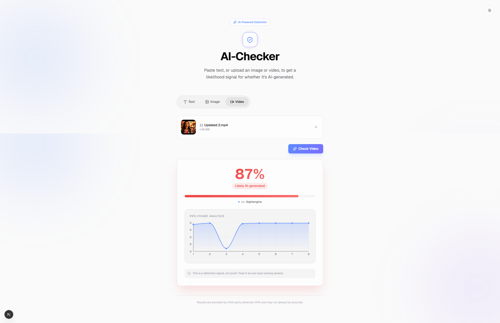

<div align="center">

# 🤖 AI-Checker

**Multi-modal AI content detection with resilient provider orchestration**

Estimate the likelihood that text, an image, audio, or video was generated by AI —
backed by an automatic provider fallback chain that keeps working when vendors fail.

[](https://github.com/SadmaFaahiim/ai-checker/actions/workflows/ci.yml)


</div>

---

## 📖 About

AI-Checker is a proof-of-concept web application built on **Next.js 16 (App Router)** with **TypeScript strict mode**. It deliberately runs **no detection model in-process** — instead it calls third-party detection APIs and normalizes their responses into one consistent output shape.

The core engineering problem this project solves is **provider reliability**: free-tier detection APIs rate-limit aggressively and go down. Every modality is therefore backed by an *ordered provider chain* with transparent failover — the UI degrades gracefully instead of erroring the moment one vendor's quota is exhausted.

**One request, one shape — every modality:**

```json
{ "percentage": 78, "verdict": "Likely AI-generated", "provider": "sapling" }
```

---

## ✨ Features

| | |
|---|---|
| 🖼️ **Multi-modal detection** | Text, images (JPG/PNG), audio (MP3/WAV/M4A/OGG/FLAC/WEBM), video (MP4) — one unified interface |
| 🔁 **Provider fallback chain** | Ordered providers per modality; 429 / 401 / 5xx / timeout / malformed → transparent failover with an 8s timeout per provider |
| 🛡️ **Magic-byte upload validation** | Server-side signature sniffing — spoofed MIME types and renamed executables rejected with `400` before any provider call |
| ⚡ **Rate limiting** | Per-modality sliding windows (text 20/min · image 10/min · audio 6/min · video 4/min) with `429` + `Retry-After`; size-capped store; client IPs HMAC-hashed (GDPR) |
| 🩺 **Health reporting** | `GET /api/health` — credential-presence status derived from the provider-chain registry; free for uptime monitors to poll |
| 📈 **Error tracking** | Optional Sentry (server + client) with route/modality tags; fully no-op without a DSN |
| 🎞️ **Video frame analysis** | 8 evenly-spaced FFmpeg frames scored independently, averaged, with a per-frame timeline chart |
| 🌗 **Dark/Light theme** | System-preference detection, persisted manual override |
| ✨ **Polished UX** | Animated result card (Framer Motion), skeleton loaders, toasts, drag-and-drop uploads, client-side validation, mobile responsive |

---

## 📸 Screenshots

| Text — Human | Text — AI |
|---|---|
|  |  |

| Image — Human | Image — AI |
|---|---|
|  |  |

| Video — Human | Video — AI |
|---|---|
|  |  |

---

## 🏗️ System Design

### Request lifecycle

```
 ┌──────────────┐         ┌─────────────────────────────────────────────────┐         ┌──────────────────┐
 │    Client    │  POST   │                API Route (Node.js)              │         │     Providers    │
 │  (React 19)  │ ──────▶ │                                                 │         │                  │
 │              │         │  1. checkRateLimit()      ── 429 + Retry-After  │         │  ┌────────────┐  │
 │ drag & drop  │         │     (sliding window · HMAC-hashed IP)           │         │  │  primary   │  │
 │ validation   │         │  2. parse + Zod schema    ── 400 on invalid     │ ──────▶ │  ├────────────┤  │
 │ toasts       │ ◀────── │  3. size + MIME allow-list──────── 400          │  fail → │  │  fallback  │  │
 │              │  200 /  │  4. magic-byte sniff      ── 400 on spoof      │  next   │  ├────────────┤  │
 │  verdict +   │  4xx/5xx│  5. detectWithFallback(chain)                   │ ◀────── │  │  stub (⏭)  │  │
 │  percentage  │         │     ↳ 8s timeout per provider, auto-failover    │         │  └────────────┘  │
 └──────────────┘         │  6. toVerdict() → unified JSON shape            │         └──────────────────┘
                          └───────────────┬─────────────────────────────────┘
                                          │ 503 only when the whole chain fails
                                          ▼
                          ┌─────────────────────────────────┐
                          │        Observability            │
                          │  console.warn per failover      │
                          │  Sentry captureServerError()    │
                          │  GET /api/health (no vendor IO) │
                          └─────────────────────────────────┘
```

### The fallback orchestrator

`detectWithFallback(providers, input)` — `lib/fallback.ts` — is vendor-agnostic. It iterates the ordered chain, races each call against an **8-second timeout**, returns the first success, and aggregates every failure reason into the `503` error when the chain is exhausted:

| Failure | Trigger |
|---|---|
| `429` | provider quota exceeded |
| `401` / `403` | invalid or expired API key |
| `5xx` | provider-side server error |
| timeout | no response within 8s |
| schema mismatch | response fails shape validation |

### Single source of truth

Provider chains are declared **once** in `lib/providers/chains.ts` — each entry carries the provider object, its required env keys, role (`primary` / `fallback` / `stub`) and notes. API routes import the provider arrays; the `/api/health` report derives roles, env keys and notes from the *same* entries. A new provider added to a chain is automatically covered by health reporting — enforced by a regression test.

### Defense in depth (uploads)

```
client validation ──▶ rate limit ──▶ MIME allow-list ──▶ magic bytes ──▶ provider chain
  (no round trip)     (429)          (400)                (400)            (failover / 503)
```

Rejected requests cost **zero provider quota** — every guard runs before the first vendor call, and magic-byte sniffing happens before any disk write on the video route.

---

## 🧰 Tech Stack

| Category | Technology | Version |
|---|---|---|
| Framework | Next.js (App Router) | 16.x |
| Language | TypeScript (strict mode) | 5.x |
| Runtime | React | 19.x |
| Styling | Tailwind CSS (CSS-first config) | 4.x |
| Animation | Framer Motion | 12.x |
| HTTP Client | Axios | 1.x |
| Validation | Zod | 4.x |
| File Upload | react-dropzone | 17.x |
| Video Processing | fluent-ffmpeg + @ffmpeg-installer/ffmpeg | 2.x / 1.x |
| Charts | Recharts | 3.x |
| Notifications | react-hot-toast | 2.x |
| Icons | Lucide React | 1.x |
| Testing | Vitest + @vitest/coverage-v8 | 3.x |
| Error Tracking | @sentry/nextjs (optional) | 10.x |

> Tailwind v4 note: this project uses the CSS-first configuration model — there is no `tailwind.config.ts`. Theme tokens live in `app/globals.css` via `@theme` and `@custom-variant`.

---

## 📁 Project Structure

```
ai-checker/
├── app/
│   ├── layout.tsx                   # Root layout — theme provider, Toaster, metadata, fonts
│   ├── page.tsx                     # Main page — hero, tab-based UI, panel switching
│   ├── globals.css                  # Tailwind v4 theme tokens, dark-mode variant, keyframes
│   └── api/
│       ├── health/route.ts          # GET /api/health — chain-derived credential status
│       └── check/
│           ├── routes.test.ts       # Route-integration tests (all four endpoints)
│           ├── text/route.ts        # POST /api/check/text
│           ├── image/route.ts       # POST /api/check/image
│           ├── audio/route.ts       # POST /api/check/audio
│           └── video/route.ts       # POST /api/check/video — FFmpeg frame fan-out
├── components/
│   ├── TabSwitcher.tsx              # Segmented control, animated sliding indicator
│   ├── TextCheckPanel.tsx           # Textarea, live char count, client-side validation
│   ├── ImageCheckPanel.tsx          # Drag-and-drop, thumbnail preview, size/type checks
│   ├── AudioCheckPanel.tsx          # Drag-and-drop, format/size validation
│   ├── VideoCheckPanel.tsx          # MP4-only upload, duration/size validation
│   ├── ResultCard.tsx               # Animated counter, gradient bar, verdict badge
│   ├── FrameTimelineChart.tsx       # Recharts per-frame score timeline
│   ├── ThemeProvider.tsx            # System detection + persistence, no-flash script
│   └── ThemeToggle.tsx              # Animated day/night toggle
├── lib/
│   ├── fallback.ts                  # Fallback orchestrator — 8s timeout, ordered failover
│   ├── scoring.ts                   # toVerdict() — percentage → verdict bucket
│   ├── chains → providers/chains.ts # ⭐ Single source of truth: provider chains registry
│   ├── health.ts                    # /api/health report — derived from the registry
│   ├── rateLimit.ts                 # Sliding-window limiter — capped store, HMAC'd IPs
│   ├── magicBytes.ts                # Upload signature sniffing (JPG/PNG/MP3/WAV/MP4/…)
│   ├── sentry.ts                    # DSN-gated error tracking helpers
│   ├── videoFrames.ts               # FFmpeg — evenly-spaced JPEG frame extraction
│   └── providers/
│       ├── chains.ts                # ⭐ ChainEntry { provider, envKeys, role, note } ×4
│       ├── types.ts                 # Provider, DetectionResult, ProviderUnavailableError
│       ├── text/                    # sapling (primary) · gptzero (fallback) · zerogpt (stub)
│       ├── image/                   # sightengine (primary) · aiornot (stub)
│       └── audio/                   # sightengine (primary) · aiornot (stub)
├── docs/
│   └── screenshots/                 # README gallery images
├── .github/workflows/ci.yml         # CI: lint → typecheck → test (coverage gate) → build
├── instrumentation.ts               # Sentry server init (DSN-gated)
├── instrumentation-client.ts        # Sentry client init (DSN-gated)
├── ROADMAP.md                       # Role-wise roadmap · phases · KPIs · risk register
├── TASKS.md                         # Phase 1 task board
├── BENCHMARK.md                     # Benchmark corpus specification
└── .env.example                     # Documented environment template
```

⭐ = the wiring point for adding a new provider (see [Provider Configuration](#provider-configuration)).

---

## 🚀 Getting Started

### Prerequisites

- **Node.js** ≥ 18.17 · **npm** ≥ 9 · **Git**
- Free-tier API keys: **[Sapling](https://sapling.ai)** (text) and **[Sightengine](https://sightengine.com)** (image/audio/video)

> FFmpeg is bundled automatically via `@ffmpeg-installer/ffmpeg` — no system install needed.

### 1. Clone & install

```bash
git clone https://github.com/SadmaFaahiim/ai-checker.git
cd ai-checker
npm install
```

### 2. Configure environment

```bash
cp .env.example .env.local
# open .env.local and add your API keys
```

### 3. Run

```bash
npm run dev
# → http://localhost:3000
```

### 4. Verify

Open the app, paste 20+ characters into the **Text** tab, hit **Check Text**. A result card with a percentage + verdict confirms your Sapling key. A "temporarily unavailable" toast means the key is missing/invalid — check `.env.local` and restart the dev server (env vars are read at process start).

---

## 🔑 Environment Variables

```bash
# ── Detection providers ─────────────────────────────────────────────
# Sapling — text PRIMARY · free tier: 50,000 chars/day · https://sapling.ai
SAPLING_API_KEY=

# Sightengine — image/audio/video PRIMARY · free tier: 2,000 ops/month
SIGHTENGINE_API_USER=
SIGHTENGINE_API_SECRET=

# GPTZero — text fallback · requires a paid subscription · leave blank to skip
GPTZERO_API_KEY=

# AI or Not — image/audio fallback · stubbed (no confirmed public API) · leave blank
AIORNOT_API_KEY=

# ── Operations ──────────────────────────────────────────────────────
# Rate limiting — HMAC secret for hashing client IPs (GDPR).
# Set the SAME value on every instance; a process-derived fallback is used otherwise.
RATE_LIMIT_IP_SECRET=

# Sentry — error tracking (optional). Blank = fully disabled (every helper is a no-op).
SENTRY_DSN=
NEXT_PUBLIC_SENTRY_DSN=
```

| Variable | Required | Notes |
|---|---|---|
| `SAPLING_API_KEY` | Yes (text) | Without it, text falls through to GPTZero (paid) and ZeroGPT (stub) — effectively unavailable. |
| `SIGHTENGINE_API_USER` / `_SECRET` | Yes (image/audio/video) | Primary provider for all three; video reuses it per sampled frame. |
| `GPTZERO_API_KEY` | No | Documented text fallback; paid plan required to function. |
| `AIORNOT_API_KEY` | No | Stubbed fail-fast provider; kept for chain completeness. |
| `RATE_LIMIT_IP_SECRET` | Recommended | Keys the HMAC that hashes client IPs; must match across instances. |
| `SENTRY_DSN` / `NEXT_PUBLIC_SENTRY_DSN` | No | Enables Sentry; a DSN is public-safe by design (send-only). |

**Security:** `.env.local` is gitignored and never committed. Keys are read server-side via `process.env` only — never bundled into client JavaScript.

---

## 🔌 API Reference

All detection endpoints run on the Node.js runtime, are rate-limited per client IP, and validate uploads by magic bytes. Full request/response examples with `curl` for every endpoint live in the [API documentation section of the wiki-style docs below](#-api-endpoints).

| Endpoint | Method | Body | Limits | Errors |
|---|---|---|---|---|
| `/api/check/text` | POST | JSON `{ text }` | ≥ 20 chars | `400` validation · `429` rate limit · `503` chain exhausted |
| `/api/check/image` | POST | form-data `image` | JPG/PNG ≤ 10MB | `400` validation/magic-bytes · `429` · `503` |
| `/api/check/audio` | POST | form-data `audio` | ≤ 20MB, 6 formats | `400` validation/magic-bytes · `429` · `503` |
| `/api/check/video` | POST | form-data `video` | MP4 ≤ 20MB | `400` validation/magic-bytes/decode · `429` · `503` |
| `/api/health` | GET | — | — | always `200` (`ok` / `degraded`) |

**Unified success shape:**

```json
{ "percentage": 45, "verdict": "Uncertain", "provider": "sightengine" }
```

Video additionally returns `"perFrame": [32, 41, …]` for the timeline chart.

<details>
<summary><b>📖 Full API endpoints documentation (click to expand)</b></summary>

### POST `/api/check/text`

**Request** (`application/json`):

```json
{ "text": "Your text to analyze here — at least 20 characters." }
```

**Response** (`200`):

```json
{ "percentage": 78, "verdict": "Likely AI-generated", "provider": "sapling" }
```

**Errors:** `400` — missing text or < 20 chars after trimming · `503` — every provider failed.

```bash
curl -X POST http://localhost:3000/api/check/text \
  -H "Content-Type: application/json" \
  -d '{"text": "Your text to analyze here..."}'
```

### POST `/api/check/image`

**Request** (`multipart/form-data`): field `image` — JPG/PNG ≤ 10MB.

**Response** (`200`): `{ "percentage": 12, "verdict": "Likely Human", "provider": "sightengine" }`

**Errors:** `400` — no file, unsupported MIME, > 10MB, or bytes ≠ declared type · `429` · `503`.

```bash
curl -X POST http://localhost:3000/api/check/image -F "image=@/path/to/image.jpg"
```

### POST `/api/check/audio`

**Request** (`multipart/form-data`): field `audio` — MP3/WAV/M4A/OGG/FLAC/WEBM ≤ 20MB.

**Response** (`200`): `{ "percentage": 23, "verdict": "Likely Human", "provider": "sightengine" }`

**Errors:** `400` — no file, unsupported MIME, > 20MB, or bytes ≠ declared type · `429` · `503`.

```bash
curl -X POST http://localhost:3000/api/check/audio -F "audio=@/path/to/audio.mp3"
```

### POST `/api/check/video`

**Request** (`multipart/form-data`): field `video` — MP4 ≤ 20MB.

**Response** (`200`):

```json
{ "percentage": 45, "verdict": "Uncertain", "provider": "sightengine", "perFrame": [32, 41, 55, 48, 39, 52, 47, 44] }
```

**Errors:** `400` — no file, unsupported MIME, > 20MB, bytes ≠ declared type, or FFmpeg decode failure · `503`.

```bash
curl -X POST http://localhost:3000/api/check/video -F "video=@/path/to/video.mp4"
```

### GET `/api/health`

Credential-presence status derived from the provider-chain registry. Never calls a vendor API — safe for uptime monitors. Always `200`; `status` is `ok` when ≥ 1 provider is configured, `degraded` otherwise.

```json
{
  "status": "ok",
  "uptimeSeconds": 1204,
  "timestamp": "2026-09-19T06:30:00.000Z",
  "providers": [
    { "id": "sapling", "modality": "text", "role": "primary", "envKeys": ["SAPLING_API_KEY"], "configured": true }
  ]
}
```

</details>

---

## 🏷️ Verdict Buckets

| Range | Verdict | Indicator |
|---|---|---|
| 0–34% | Likely Human | 🟢 Green |
| 35–65% | Uncertain | 🟡 Amber |
| 66–100% | Likely AI-generated | 🔴 Red |

Defined in one place — `toVerdict()` in `lib/scoring.ts` — adjustable without touching UI or routes. (Benchmark-driven recalibration is specified in [BENCHMARK.md](./BENCHMARK.md).)

---

## 🧪 Quality & Testing

```bash
npm test               # full suite, CI mode
npm run test:watch     # watch mode
npm run test:coverage  # coverage run — fails below the 60% gate
npx tsc --noEmit       # typecheck
npx eslint .           # lint
```

- **150 tests, all green** · **~91% line coverage on `lib/`** (gate: 60% on lines/branches/functions/statements, enforced in CI)
- Coverage spans the fallback orchestrator, verdict scoring, magic-byte validation, the rate limiter (incl. IP hashing + store eviction), the health registry, Sentry helpers, all provider adapters, and **route-level integration tests** for every endpoint
- All HTTP is mocked — **zero real provider calls** in the suite; FFmpeg is mocked at the frame-extraction boundary
- CI (`.github/workflows/ci.yml`): **lint → typecheck → test (coverage gate) → build** on every PR and push to `main`

---

## 🧭 Provider Configuration

| Modality | Priority | Provider | Status | Free tier |
|---|---|---|---|---|
| Text | 1 | [Sapling](https://sapling.ai/docs/api/detector) | ✅ Active | 50k chars/day |
| Text | 2 | [GPTZero](https://gptzero.stoplight.io/) | 💰 Paid only | — |
| Text | 3 | ZeroGPT | ⏸️ Stubbed | no confirmed public API |
| Image | 1 | [Sightengine](https://sightengine.com/docs/ai-generated-image-detection) | ✅ Active | 2k ops/month |
| Image | 2 | AI or Not | ⏸️ Stubbed | no confirmed public API |
| Audio | 1 | Sightengine (`/audio/check.json`) | ✅ Active | shared quota |
| Audio | 2 | AI or Not | ⏸️ Stubbed | no confirmed public API |
| Video | — | reuses the **image chain** per sampled frame | ✅ | shared quota |

### Adding a new provider

1. Implement the `Provider` interface from `lib/providers/types.ts` (`name` + `detect(input)`), throwing `ProviderUnavailableError` for any failure that should trigger failover.
2. Register it in **`lib/providers/chains.ts`** — add a `ChainEntry` (provider, `requiredEnvKeys`, role) to the relevant chain, in priority order.
3. Done. The route picks it up automatically, `/api/health` reports it automatically (CI-enforced), and no orchestrator/UI/response changes are needed.

---

## 🗺️ Roadmap & Docs

| Document | Purpose |
|---|---|
| [ROADMAP.md](./ROADMAP.md) | Role-wise ownership matrix, phased timeline (Q4 2026 → Q2 2027), KPIs, risk register |
| [TASKS.md](./TASKS.md) | Phase 1 (Hardening) working board with acceptance criteria |
| [BENCHMARK.md](./BENCHMARK.md) | How detection quality is measured — corpus, labeling, metrics, thresholds |

**Phase 1 — Hardening** is effectively complete: 150-test suite with a coverage gate, CI pipeline, rate limiting (hardened), magic-byte validation, health endpoint, Sentry, and the benchmark spec. Next up (Phase 2 — Product): history dashboard, persistence, per-user API keys.

---

## 📦 Build & Deploy

```bash
npm run build   # production build
npm start       # start the production server
```

- All API routes pin `runtime = "nodejs"` — FFmpeg and Buffer handling are unavailable on Edge.
- `fluent-ffmpeg` + installers are `serverExternalPackages` (dynamic `require()` of native binaries).
- Video processing is long-running; a long-lived host (VPS / Railway / Render) is recommended over strictly-serverless targets.
- Environment variables go through the platform's dashboard/secrets manager — `.env.local` never deploys.

---

## ⚠️ Limitations & Scope

Intentional POC constraints:

- No user authentication, accounts, or persistence — results aren't saved between sessions.
- No in-process models — accuracy depends entirely on third-party providers.
- Format caps: images JPG/PNG ≤ 10MB · audio ≤ 20MB · video MP4 ≤ 20MB.
- Free-tier quotas will exhaust under sustained load (rate limiting delays, not prevents, this).
- **Every result card carries the disclaimer:** *"This is a detection signal, not proof. Treat it as one input among several."* AI detection is probabilistic — no result is a certified verdict.

---

## 📄 License

Internal project — **NeoNexor Software**. Not licensed for external distribution.
